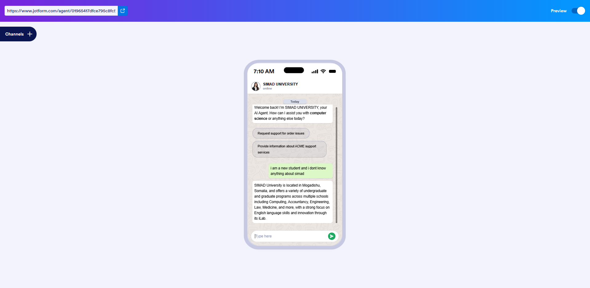

# 🎓 SIMAD University AI WhatsApp Agent  

An **AI-powered WhatsApp Assistant** built for **SIMAD University**, designed to help students, staff, and visitors get instant support directly on **WhatsApp**.  

With this agent, new students can ask questions like:  

> *“I am a new student and I don’t know anything about SIMAD.”*  

And the bot instantly replies with university details, programs, and guidance.  


---

## 🚀 Features  
- 📲 **WhatsApp Integration** – chat with the AI directly on WhatsApp  
- 🤖 AI-driven conversational assistant  
- 🎓 Provides university info (programs, schools, services, iLab, etc.)  
- 💬 Real-time responses in WhatsApp chat format  
- 🔍 Handles queries from new/existing students and staff  
- 🌐 Powered by **Jotform AI Agent + WhatsApp API**  

---

## 🛠️ Tech Stack  
- **Frontend:** WhatsApp Chat Interface  
- **Backend AI:** Jotform AI Agent  
- **Integration:** WhatsApp Business API  

---

## 📸 Demo  
**Sample Interaction:**  

**Student:**  
> I am a new student and I don’t know anything about SIMAD.  

**AI Agent:**  
> SIMAD University is located in Mogadishu, Somalia, and offers a variety of undergraduate and graduate programs…  



---

## 📂 Project Structure  
```bash
.
├── demo.png        # Screenshot of WhatsApp Agent
├── README.md       # Documentation
└── (Other files if applicable)
